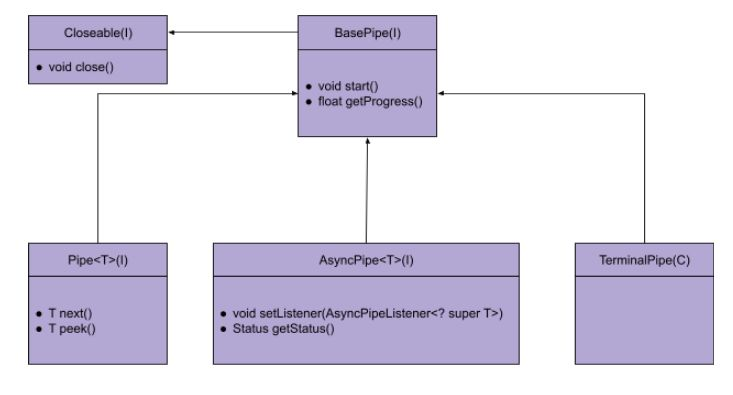

# Async Pipes

So far, we have seen synchronous pipes, which work with a pulling mechanism. Once started, the caller has to pull item by item using the Pipe.next() method. Asynchronous pipes on the other hand work with a push mechanism. Once they are started, they start pushing items (and other control events) to the successor pipe, possibly by multiple threads. Async pipes are an essential part of distributed pipes (see next section), but also have benefits when used in a single worker environment.

Events are notified using a listener (see AsyncPipeListener). The item handoff from async pipe A to pipe B is enabled by B registering itself as the listener of A. The registering takes place implicitly, whenever a pipe is constructed with async pipe/s as input/s. The design follows the reactive programming principles, where there are three types of notifications:

1. Item event - Indicating that a predecessor pipe wishes to pass an item to the current pipe

2. Error event - indicating that the predecessor pipe reports an abnormal termination of its work

3. Done event - indicating that the predecessor pipe reports a successful termination of its work

Events may come from different threads, but there are some strong guarantees provided by an async pipe implemented according to spec:

1. Once an error event or a done event is reported, no more item events are reported

2. Only one of error/done event types may be reported, and only once instance of them

3. When closing an async pipe (BasePipe.close()), once the method terminates there are no other notifications

Async pipes is a separate family of pipes, sometimes having a sync version with equivalent functionality (e.g. FilterPipe vs AsyncFilterPipe, and MapPipe vs AsyncFilterPipe). There are two important properties to remember when working with async pipes: unlike sync pipes, they are thread safe, and unlike sync pipes - they produce items in no particular order (and possibly even non-deterministic order).


## Class Hierarchy
Async pipes, sync pipes and terminal pipes are mutually exclusive families of pipes, and have very basic functionalities in common: all are Closeable, support the start() method and the getProgress() method (though there are some subtle differences with their start() method contract). These common functionalities are provided by their super-interface, which is the topmost pipe ancestor - **BasePipe** interface.



## Back to the customer DB query
In the previous section we presented a single threaded solution and a parallel solution for the DB query scenario. Following is an async solution. While both parallel and async approaches are multi-threaded, there is an important structural difference. In parallel pipes we must replicate sub-flows and pass them to a ParallelConsumerPipe acting as a sink pipe. Each sub flow is assigned one thread to process it end to end. Async pipes approach on the other hand doesn't require sub-flow replication, and allows multiple threads to operate on the same flow. The async solution looks as follows:

```java
public static void queryAsync(File dbFolder, long from, long to) throws IOException, PipeException, InterruptedException {
  try (
      AsyncPipe<CustomerSummary> readerP = new AsyncMultiFileReaderPipe<>(
          LocalMultiFileReaderConfig.builder(CUSTOMER_SUMMARY_DECODER)
          .paths(dbFolder)
          .threadNum(8)
          .build());
      AsyncPipe<CustomerSummary> filterP = new AsyncFilterPipe<>(readerP, 
          s -> from <= s.getLastPurchaseTime() && to >= s.getFirstPurchaseTime());
      TerminalPipe outputP = new AsyncConsumerPipe<>(filterP, cs -> System.out.println(cs.getCustomerId()));
      ) {
    outputP.start();
  }
}
```

The source pipe is **AsyncMultiFileReaderPipe**. It's very similar in its configuration to the sync version (MultiFileReaderPipe), except that it supports the threadNum(..) builder parameter. It specifies in this case that we want 8 threads to read data from the input folder. These threads are owned by the multi-reader pipe, and operate all the way down the flow. The next pipe (**AsynFilterPipe**) is the async version of the FilterPipe, and also accepts an item predicate. The sink pipe in our case is **AsyncConsumerPipe**, which is the async version of ConsumerPipe.

## Sync/Async transformations
Unlike the example above which is purely async, a flow may be composed of async and sync parts. The connecting points require "adapter pipes". We have 2 such adapters:

1. **AsyncToSyncPipe** - A sync pipe receiving an async pipe as input. Uses a queue for holding items ready to be pulled. The blocking queue can be supplied by the caller. Besides the standard java implementations (ArrayBlockingQueue and LinkedBlockingQueue), consider using org.pipecraft.infra.concurrent.LockFreeBlockingQueue, which wraps a lock-free non-blocking queue and achieves good throughput in some cases.
However, take into consideration that AsyncToSyncPipe can easily become a bottleneck in the flow, and should be used only when there's no other alternative, or when item insertion rate isn't expected to be too high.

2. **SyncToAsyncPipe** - An async pipe taking multiple sync pipes as inputs, and using K threads to read them and pass the items asynchronously to the following pipe. Since each input pipe can only be handled by one thread (sync pipes aren't thread safe), there's no benefit in passing less input pipes than the required number of threads.

[<< Prev](parallel_pipes.md) [Next >>](distributed_pipes.md)
