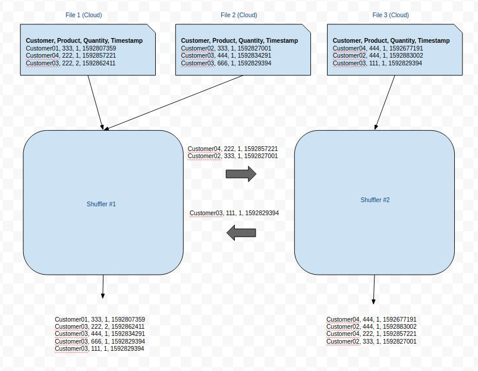
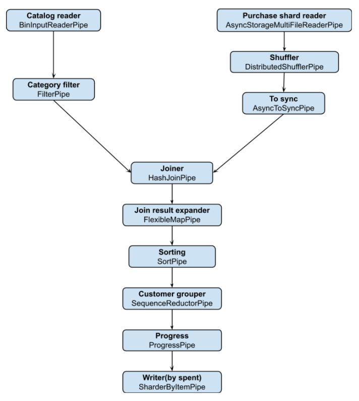

# Distributed Pipes

In the "Codecs" section we produced customer summaries given a catalog file and a set of purchase history files. The solution was single threaded, and it's a reasonable choice assuming a total history files volume in order of magnitude around 50 GB.

What if each run has to deal with Terabytes of data? Parallel/Async pipes allow vertical scaling by small factors, but not by 100. This time we will need a distributed solution, where multiple workers split the work between them. 

The main building block in the framework which allows distribution it is the **DistributedShufflerPipe**. It's an intermediate async pipe that communicates with other shuffler pipes on other machines in order to split (or shuffle) their input items between the workers. Although the pipe input can be anything we choose, typically a pipeline starts by arbitrarily splitting the inputs into K shards, and let each worker be exclusively responsible for reading that shard and pass it to the shuffler. The shuffler then examines the data itself, and re-distributes it between workers, this time based on individual item properties. 

For example, in our case we would like each worker to be able to see complete customer history for a given customer, therefore the shuffling should be based on customer id. This means that the outputs of the shufflers will be disjoint, and each shuffler will produce history records of a unique set of customer ids. Although this sharding+shuffling approach seems expensive, it requires transferring all data at most twice over the network. 

The sharding+shuffling in our case can be illustrated as follows:


In the example above the three input files are split arbitrarily between two workers. Then the shufflers start exchanging items, so that shuffler #1 remains with odd customer ids and shuffler #2 with the even ones. The rest of the pipes flow can then do the necessary aggregations, produce its output and upload it back to cloud.
Below is the complete solution, presented as a class with main(). What remains is to run the same pipeline from multiple instances, providing each copy with proper CLI arguments.

```java
public class CustomerSummaryPipelineDistributed {
  private static final DecoderFactory<Purchase> PURCHASE_DECODER = new TxtDecoderFactory<>(Purchase::fromCSV);
  private static final EncoderFactory<Purchase> PURCHASE_ENCODER = new TxtEncoderFactory<>(Purchase::toCSV);
  private static final CodecFactory<Purchase> PURCHASE_CODEC = new DelegatingCodecFactory<>(PURCHASE_ENCODER, PURCHASE_DECODER);
  
  private static final DecoderFactory<Product> PRODUCT_DECODER = new TxtDecoderFactory<>(Product::fromCSV);
  private static final EncoderFactory<Product> PRODUCT_ENCODER = new TxtEncoderFactory<>(Product::toCSV);
  private static final CodecFactory<Product> PRODUCT_CODEC = new DelegatingCodecFactory<>(PRODUCT_ENCODER, PRODUCT_DECODER);

  private static final EncoderFactory<CustomerSummary> CUSTOMER_SUMMARY_ENCODER = new TxtEncoderFactory<>(CustomerSummary::toCSV);
  private static final DecoderFactory<CustomerSummary> CUSTOMER_SUMMARY_DECODER = new TxtDecoderFactory<>(CustomerSummary::fromCSV);
  private static final CodecFactory<CustomerSummary> CUSTOMER_SUMMARY_CODEC = new DelegatingCodecFactory<>(CUSTOMER_SUMMARY_ENCODER, CUSTOMER_SUMMARY_DECODER);
  
  private static <M> void computeCustomerSummaries(List<HostPort> workers, int workerIndex, 
      Storage<?, M> storage, String bucketName, String catalogFilePath, String purchaseFilesFolderPath, 
      Set<String> categories, File outputFolder) throws IOException, PipeException, InterruptedException {
    File catalogFile = downloadCatalog(storage, bucketName, catalogFilePath);
    try (
        Pipe<Product> catReaderP = new BinInputReaderPipe<>(catalogFile, PRODUCT_DECODER);
        Pipe<Product> catFilterP = new FilterPipe<>(catReaderP, c -> categories.contains(c.getCategory()));
        
        AsyncPipe<Purchase> purchaseP = new AsyncStorageMultiFileReaderPipe<>(
            StorageMultiFileReaderConfig.<Purchase, M>builder(PURCHASE_DECODER)
            .bucket(storage, bucketName)
            .paths(purchaseFilesFolderPath)
            .shard(new ShardSpecifier(workerIndex, workers.size()))
            .build());
        
        DistributedShufflerPipe<Purchase> shufflerP = new DistributedShufflerPipe<>(purchaseP, 
            DistributedShufflerConfig.<Purchase>builder()
            .workers(new HashSet<>(workers))
            .port(workers.get(workerIndex).getPort())
            .codec(PURCHASE_CODEC.getByteArrayCodec())
            .shardBy(Purchase::getCustomerId)
            .build()
            );

        AsyncToSyncPipe<Purchase> workerP = new AsyncToSyncPipe<>(shufflerP, 10_000, () -> new Purchase(null, 0, 0, 0));
        
        Pipe<JoinRecord<Integer, Product, Purchase>> joinP = new HashJoinPipe<>(
            catFilterP, 
            Product::getProductId,  // Join key extractor on catalog entries
            workerP, 
            Purchase::getProductId, // Join key extractor on purchases
            JoinMode.INNER,
            50,                     // 50 data partitions by product id
            PRODUCT_CODEC, 
            PURCHASE_CODEC, 
            FileUtils.getSystemDefaultTmpFolder());
            
        Pipe<CustomerSummary> prodAmountP = new FlexibleMapPipe<>(joinP, CustomerSummaryPipelineDistributed::toIntermediateCustomerSummary);
        Pipe<CustomerSummary> sortP = new SortPipe<>(prodAmountP, 200_000, CUSTOMER_SUMMARY_CODEC, Comparator.comparing(CustomerSummary::getCustomerId));
        Pipe<CustomerSummary> aggrP = new SequenceReductorPipe<>(sortP,
            ReductorConfig.<CustomerSummary,String,CustomerSummary,CustomerSummary>builder()
                .discriminator(CustomerSummary::getCustomerId)
                .aggregatorCreator(CustomerSummary::new)
                .aggregationLogic(CustomerSummary::merge)
                .postProcessor(Functions.identity()).build()
        );
        Pipe<CustomerSummary> progressP = new ProgressPipe<>(aggrP, 1000, pct -> System.out.println("Progress: " + pct));
        TerminalPipe sharderP = new SharderByItemPipe<>(progressP, CUSTOMER_SUMMARY_ENCODER, 
            s -> workerIndex + "_" + s.getTotalSpentCents() / 1000 + ".csv", outputFolder);
        ) {
      sharderP.start();
    }
  }

  private static File downloadCatalog(Storage<?, ?> storage, String bucketName, String catalogFilePath) throws IOException {
    Bucket<?> bucket = storage.getBucket(bucketName);
    File catalogFile = FileUtils.createTempFile("catalog", ".csv");
    bucket.getSliced(catalogFilePath, catalogFile);
    return catalogFile;
  }

  private static Pipe<CustomerSummary> toIntermediateCustomerSummary(JoinRecord<Integer, Product, Purchase> joinRec) {
    List<CustomerSummary> summaries = new ArrayList<>();
    Product catalogEntry = joinRec.getLeft().get(0); // We expect a single catalog entry match in the join
    for (List<Purchase> purchases : joinRec.getRight().values()) {
      for (Purchase purchase : purchases) {
        long purchaseTime = purchase.getTimestamp();
        int spentCents = purchase.getQuantity() * catalogEntry.getPriceCents();
        CustomerSummary summary = new CustomerSummary(purchase.getCustomerId(), spentCents, purchaseTime, purchaseTime);
        summaries.add(summary);
      }
    }
    return new CollectionReaderPipe<>(summaries);
  }
  
  public static void main(String[] args) throws Exception {
    List<HostPort> workers = HostPort.getHostPorts(args[0]);
    int workerIndex = Integer.parseInt(args[1]);
    GoogleStorage gs = new GoogleStorage();
    String bucketName = args[2];
    String catalogFilePath = args[3];
    String purchaseFolderPath = args[4];
    Set<String> categories = Arrays.stream(args[5].split(",")).collect(Collectors.toSet());
    String outputFolderPath = args[6];
    File localOutFolder = FileUtils.createTempFolder("cust_summary_tmp");
    computeCustomerSummaries(workers, workerIndex, gs, bucketName, catalogFilePath, purchaseFolderPath, categories, localOutFolder);
    gs.getBucket(bucketName).putAllInterruptibly(outputFolderPath, localOutFolder, 8, false);
  }
}
```
The new flow can be described with the following diagram:


As you can see, there are relatively small changes to the flow compared to the original non-distributes solution: The catalog is first downloaded from cloud, and we also introduced **AsyncStorageMultiFileReaderPipe** for initial sharding, and **DistributedShufflerPipe** for the shuffling than comes next. The subsequent logic applied to the items "owned" by each worker remains the same, with a minor difference in the output file naming. Each worker will shard the output records by total spent, meaning that for the same amount range the pipeline as a whole may end up with as many files as the number of workers. In order to avoid files from overriding each other, we add a prefix specifying the worker id (see SharderByItemPipe part).

Besides the change in the flow itself, we added a main() method that receives the worker configuration. It consists of generic arguments which are mandatory in every distributed pipeline (complete workers lists and current worker index in the list), as well as specific arguments (catalog path in cloud, purchase history path in cloud etc).

The code above should be packaged and deployed on N machines. Starting the pipeline means running the same CLI on all instances. Pipes itself doesn't provide any utility for the packaging, deployment or tracking of the worker instances. This should be done externally. If you are using Google-Cloud, we strongly recommend using Airflow for that purpose, and specifically use some Python operators written specifically for this. For those not using Google-Cloud, this management layer should be developed from scratch.

> When activating the pipeline, make sure that:
> 1. All workers work with the same JAR
> 2. All CLIs are invoked approximately on the same time. The shuffler is tolerant for delays, but it may also time out if peers are started too late.
> 3. All CLIs get the same worker list as argument (exactly the same worker list string, in format "host1:port1,host2:port2....")
> 4. The worker index CLI argument ranges from 0 to #workers - 1, and each worker gets a unique index

## Testing
Testing of a distributed pipeline can be done completely locally. Workers can be started as independent processes, or even as independent components inside the same JVM process. You should just make sure that every worker is assigned a different port, since every worker creates a server socket with that port.

## Limitations
The current architecture means that shuffler pipes communicate directly between each other, meaning that the number of connections per instance increases linearly, and the overall number of connections increases quadratically in number of workers. This makes the network IO slower per machine, and also increases the probability of a connection to break.
In the future we are expecting to examine other possibilities of inter-shuffler communication, but meanwhile we recommend not working with more than 50 workers in a pipeline.

[<< Prev](async_pipes.md) [Next >>](sorted_set_operations.md)
