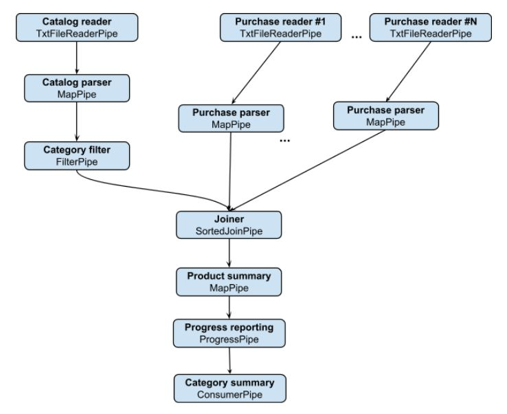

# Tree Flow
Now for a more interesting and useful scenario. We have one catalog file and multiple purchase history files, and we would like to sum total spent cents per category. The problem is that history files alone don't provide product prices or categories, therefore we have to cross them with the catalog file.
For simplicity, we will assume that both the catalog and the history files are sorted by product id. A solution for the non-sorted case will be presented in the next section.
Our inputs are the catalog file, the history file folder and the set of categories we wish to create summaries for. We are assuming that the number of categories doesn't reach millions, and that the total data volume doesn't reach hundreds of GB, where distribution should be considered.

```java
private static Map<String, Integer> computeCategorySums(File catalogFile, File purchaseFilesFolder, Set<String> categories) 
      throws IOException, PipeException, InterruptedException {
    List<Pipe<Purchase>> purchasePipes = buildPurchasePipes(purchaseFilesFolder);
    
    Map<String, Integer> catSummary = new HashMap<>();
    try (
        Pipe<String> catReaderP = new TxtFileReaderPipe(catalogFile);
        Pipe<Product> catParserP = new MapPipe<>(catReaderP, Product::fromCSV);
        Pipe<Product> catFilterP = new FilterPipe<>(catParserP, c -> categories.contains(c.getCategory()));
        Pipe<JoinRecord<Integer, Product, Purchase>> joinP = new SortedJoinPipe<>(
            catFilterP, 
            Product::getProductId, // Join key extractor on catalog entries
            purchasePipes, 
            Purchase::getProductId, // Join key extractor on purchases
            Integer::compareTo, 
            JoinMode.INNER);
        Pipe<Product> prodAmountP = new MapPipe<>(joinP, CategorySummaryPipeline::getProductSummary); 
        Pipe<Product> progressP = new ProgressPipe<>(prodAmountP, 1000, pct -> System.out.println("Progress: " + pct));
        TerminalPipe consumerP = new ConsumerPipe<>(progressP, 
            ps -> catSummary.compute(ps.getCategory(), (k, v) -> v == null ? ps.getPriceCents() : v + ps.getPriceCents()));
        ) {
      consumerP.start();
    }
    return catSummary;
  }

  private static List<Pipe<Purchase>> buildPurchasePipes(File purchaseFilesFolder) {
    List<Pipe<Purchase>> purchasePipes = new ArrayList<>();
    for (File purchaseFile : purchaseFilesFolder.listFiles()) {
      Pipe<String> readerP = new TxtFileReaderPipe(purchaseFile);
      Pipe<Purchase> mapP = new MapPipe<>(readerP, Purchase::fromCSV);
      purchasePipes.add(mapP);
    }
    return purchasePipes;
  }
  
  private static Product getProductSummary(JoinRecord<Integer, Product, Purchase> joinRec) {
    int totalCents = 0;
    int productId = joinRec.getKey();
    Product product = joinRec.getLeft().get(0); // We expect a single catalog entry match in the join
    for (List<Purchase> purchases : joinRec.getRight().values()) {
      for (Purchase purchase : purchases) {
        totalCents += purchase.getQuantity() * product.getPriceCents();
      }
    }
    return new Product(productId, product.getCategory(), totalCents);
}
```

We have one method for building and running the flow, and two helper methods. The flow topology can be visualized as follows:



> Flow diagrams can be used for a simple and intuitive description of the data processing logic, and we encourage engineers to use them in design documents

On one side of the flow we read the catalog, and filter the products according to the input category set using **FilterPipe**. On the other side, we produce a purchase parser pipe per purchase file. All the above are passed as input pipes into **SortedJoinPipe**, which joins both sides based on the product id. Use this pipe whenever a join is needed between one "left" pipe and one or more "right" pipes, where left and right data types may differ. This pipe requires the caller to define the key by which the join is done, and produces a single join record encapsulating all rows from left and right pipes sharing the same key value. It supports different join modes, and in this case we use INNER mode, meaning that we only wish to produce join records for keys seen on left side and at least on one pipe in right side. The major limitation of this pipe is the requirement of all involved pipes to be sorted by the chosen key. However, this allows the implementation to be very time/memory efficient, because it performs a linear sort-merge.

Join pipes are usually followed by a MapPipe, extracting what's needed from the complex JoinRecord object, and transforming it into a more relevant and specific data object. In this example, we use a helper method which creates the product summary: product id, product category and total spent on this product.

The next pipe is not part of the logic itself, and is used for progress tracking only. Instead of requiring the caller to use a separate thread that periodically queries specific pipes for their progress (Using Pipe.getProgress()), **ProgressPipe** can be placed in one or more strategic places in the flow, and notify a user defined callback about progress. For reporting complete flow progress accurately, it's recommended to place the progress pipe at the end of the flow (though more than one progress pipe may be needed in some cases - see the tips section).

The last pipe is used for aggregating summaries into a categories dictionary. Since the number of categories is relatively small, we can afford using a hashmap. Here we do it using a **ConsumerPipe**. In its simplest form, a consumer pipe simply drains the predecessor pipe, but it also accepts an item callback and a termination callback. Here we use the item callback for updating the hashmap entries.

[<< Prev](linear_pipes.md) [Next >>](encoders_decoders.md)

